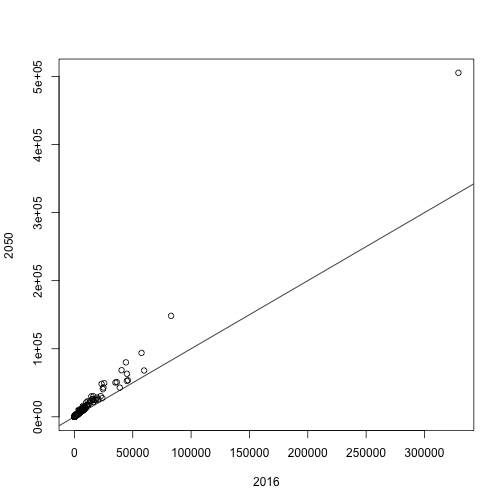
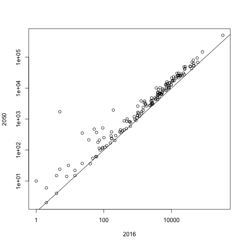
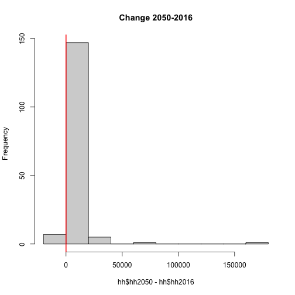
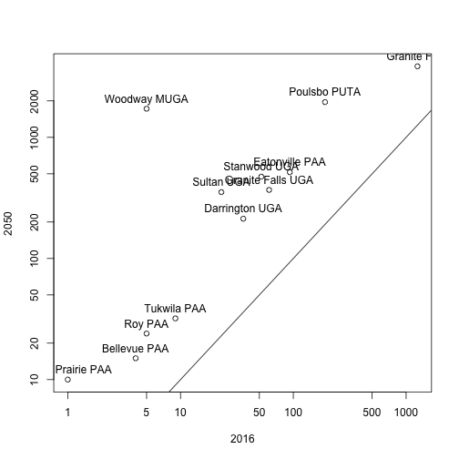

> ## Learning Objectives {.objectives}
>
> * To be able to summarize and visualize data.
>

## Data manipulation

Let's try vectorisation on the `hh2050` column of the `hh` dataset.
Make a new column in the `hh` data frame that
contains households in units of thousands of people.

~~~{.r}
hh$hh50inT <- hh$hh2050 / 1000
head(hh)
~~~

~~~{.output}
  city_id hh2016 hh2020 hh2030 hh2040 hh2050     city_name county_id county
1       1   2705   2735   2836   2939   3037 Normandy Park        33   King
2       2  24886  26527  32059  37708  43071        Auburn        33   King
3       3  45021  45724  48094  50515  52813    King-Rural        33   King
4       4  10135  11122  14449  17846  21072        SeaTac        33   King
5       5  22527  23240  25643  28097  30427     Shoreline        33   King
6       6  16769  17481  19881  22332  24658    Renton PAA        33   King
  hh50inT
1   3.037
2  43.071
3  52.813
4  21.072
5  30.427
6  24.658

~~~
Create a log transformation:

~~~{.r}
hhlog <- hh
hhlog[,2:6] <- log(hhlog[,2:6])
head(hhlog)
~~~

~~~{.output}
  city_id    hh2016    hh2020   hh2030    hh2040    hh2050     city_name
1       1  7.902857  7.913887  7.95015  7.985825  8.018625 Normandy Park
2       2 10.122061 10.185918 10.37533 10.537628 10.670605        Auburn
3       3 10.714884 10.730379 10.78091 10.830026 10.874513    King-Rural
4       4  9.223750  9.316680  9.57838  9.789535  9.955700        SeaTac
5       5 10.022470 10.053630 10.15203 10.243418 10.323086     Shoreline
6       6  9.727287  9.768870  9.89752 10.013776 10.112857    Renton PAA
  county_id county hh50inT
1        33   King   3.037
2        33   King  43.071
3        33   King  52.813
4        33   King  21.072
5        33   King  30.427
6        33   King  24.658

~~~

Create a dataset of differences:

~~~{.r}
hhdif <- cbind(hh[, c(1,7:9)], hh[,3:6] - hh[,2:5])
head(hhdif)
~~~

~~~{.output}
  city_id     city_name county_id county hh2020 hh2030 hh2040 hh2050
1       1 Normandy Park        33   King     30    101    103     98
2       2        Auburn        33   King   1641   5532   5649   5363
3       3    King-Rural        33   King    703   2370   2421   2298
4       4        SeaTac        33   King    987   3327   3397   3226
5       5     Shoreline        33   King    713   2403   2454   2330
6       6    Renton PAA        33   King    712   2400   2451   2326

~~~

~~~{.r}
summary(hhdif)
~~~

~~~{.output}
    city_id        city_name           county_id        county         
 Min.   :  1.00   Length:161         Min.   :33.00   Length:161        
 1st Qu.: 41.00   Class :character   1st Qu.:33.00   Class :character  
 Median : 82.00   Mode  :character   Median :53.00   Mode  :character  
 Mean   : 82.79                      Mean   :46.98                     
 3rd Qu.:122.00                      3rd Qu.:61.00                     
 Max.   :173.00                      Max.   :61.00                     
     hh2020            hh2030          hh2040          hh2050     
 Min.   :   -2.0   Min.   :   -6   Min.   :   -5   Min.   :   -6  
 1st Qu.:   13.0   1st Qu.:   46   1st Qu.:   46   1st Qu.:   45  
 Median :  116.0   Median :  393   Median :  400   Median :  380  
 Mean   :  469.8   Mean   : 1583   Mean   : 1617   Mean   : 1535  
 3rd Qu.:  488.0   3rd Qu.: 1643   3rd Qu.: 1678   3rd Qu.: 1593  
 Max.   :15914.0   Max.   :53635   Max.   :54773   Max.   :51999  

~~~

## Scatter plot and histogram

Plot results:

~~~{.r}
plot(hh$hh2016, hh$hh2050, xlab = "2016", ylab = "2050")
abline(0,1)
~~~

~~~{.r}
plot(hh$hh2016, hh$hh2050, xlab = "2016", ylab = "2050", log = "xy")
~~~

~~~{.error}
Warning in xy.coords(x, y, xlabel, ylabel, log): 1 x value <= 0 omitted from
logarithmic plot

~~~

~~~{.error}
Warning in xy.coords(x, y, xlabel, ylabel, log): 1 y value <= 0 omitted from
logarithmic plot

~~~

~~~{.r}
abline(0,1)
~~~

~~~{.r}
hist(hh$hh2050 - hh$hh2016, main="Change 2050-2016")
abline(v = 0, lwd = 2, col = "red")
~~~

Investigate records more than 200% increase from 2016 to 2050:

~~~{.r}
lrg <- subset(hh, (hh2050 - hh2016)/hh2016 * 100 > 200)
dim(lrg)
~~~

~~~{.output}
[1] 12 10

~~~

~~~{.r}
plot(lrg$hh2016, lrg$hh2050, xlab = "2016", ylab = "2050", log = "xy")
text(lrg$hh2016, lrg$hh2050, labels = lrg$city_name, pos = 3)
abline(0,1)
~~~

